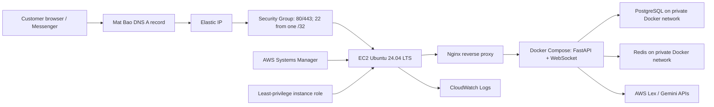

# AWS EC2 Production Infrastructure

Terraform provisions a low-cost production baseline for the chatbot stack:

- One VPC and one public subnet in the first available AZ.
- One Ubuntu 24.04 LTS EC2 instance resolved from Canonical's public SSM parameter.
- One Elastic IP for stable Mat Bao DNS.
- Nginx exposing only HTTP/HTTPS and proxying HTTP/WebSocket traffic to localhost.
- Docker Engine, Compose plugin, Git, SSM Agent, and CloudWatch Agent.
- An EC2 role with SSM and narrowly scoped CloudWatch Logs permissions.
- Optional read-only S3 deployment access, disabled by default.

This is a practical startup baseline, not a highly available design. The EC2 instance remains a single point of failure.

## Architecture



## Why Backend Ports Are Not Public

The security group intentionally does not expose `8000`, `8080`, `9000`, `9001`, `5432`, or `6379`. Nginx is the only public application entry point. FastAPI, WebSocket, Medusa, PostgreSQL, and Redis must bind to `127.0.0.1` or an internal Docker network. This prevents direct TLS bypass, database scanning, unauthenticated service access, and accidental exposure of development endpoints. WebSocket upgrades work through ports 80/443 via Nginx.

## Prerequisites

1. An AWS account with permission to create VPC, EC2, IAM, EIP, SSM, and CloudWatch resources.
2. AWS CLI authenticated with a short-lived profile or AWS IAM Identity Center. Do not use root credentials.
3. Terraform `>= 1.6`.
4. A public SSH key. SSM is preferred for routine access.

Install Terraform on macOS:

```bash
brew tap hashicorp/tap
brew install hashicorp/tap/terraform
```

Install on Ubuntu:

```bash
wget -O- https://apt.releases.hashicorp.com/gpg | sudo gpg --dearmor -o /usr/share/keyrings/hashicorp-archive-keyring.gpg
echo "deb [signed-by=/usr/share/keyrings/hashicorp-archive-keyring.gpg] https://apt.releases.hashicorp.com $(lsb_release -cs) main" | sudo tee /etc/apt/sources.list.d/hashicorp.list
sudo apt-get update && sudo apt-get install -y terraform
```

## Configure

```bash
cd infra
cp terraform.tfvars.example terraform.tfvars
curl -4 ifconfig.me
cat ~/.ssh/id_ed25519.pub
```

Set `ssh_allowed_cidr` to the returned IP with `/32`, set only the public key in `ssh_public_key`, and configure the three domains. Set `letsencrypt_email` to receive certificate notices; when omitted, Certbot registers without email. Never commit `terraform.tfvars`, private keys, AWS keys, Facebook tokens, Gemini keys, or application `.env` files.

## Validate and Deploy

```bash
terraform fmt -recursive -check
terraform init
terraform validate
terraform plan -out=tfplan
terraform show tfplan
terraform apply tfplan
```

Read outputs:

```bash
terraform output
terraform output -raw elastic_ip
terraform output -raw ssm_start_session_command
```

At Mat Bao, create three `A` records pointing to the same Terraform `elastic_ip`: the storefront, API, and chatbot hostnames. The host retries Let's Encrypt issuance every ten minutes until DNS propagation completes, then enables HTTPS and HTTP-to-HTTPS redirects automatically.

```bash
aws ssm start-session --target "$(terraform output -raw instance_id)" --region "$(terraform output -raw aws_region 2>/dev/null || echo ap-southeast-1)"
sudo systemctl status ecomoi-chatbot-tls.timer
sudo journalctl -u ecomoi-chatbot-tls.service --no-pager
sudo certbot renew --dry-run
```

Replace `ecomoi-chatbot` with `project_name` when using a different project name. The retry timer stops doing work after successful issuance, while Certbot's renewal timer keeps the certificate current.

Destroy when testing is complete:

```bash
terraform plan -destroy
terraform destroy
```

Set `enable_termination_protection = false` before destroy. Back up application and database data first.

## Application Deployment

The bootstrap creates `/opt/<project_name>/app` but does not clone source or create `.env.production`. This avoids putting Git credentials and secrets into EC2 user data, instance metadata, Terraform state, or cloud-init logs.

Recommended initial deployment:

```bash
sudo -u ubuntu git clone https://github.com/OWNER/REPOSITORY.git /opt/ecomoi-chatbot/app
sudo install -m 600 -o ubuntu -g ubuntu /dev/null /opt/ecomoi-chatbot/app/.env.production
sudo -u ubuntu nano /opt/ecomoi-chatbot/app/.env.production
cd /opt/ecomoi-chatbot/app
docker compose --env-file .env.production build
docker compose --env-file .env.production run --rm backend pnpm exec medusa db:migrate
docker compose --env-file .env.production up -d
```

For a private repository, use a read-only GitHub deploy key or immutable artifact from S3/ECR. Do not store a personal GitHub token in user data.

## GitHub Actions

`github-actions-deploy.yml.example` is an executable workflow template. Copy it to `.github/workflows/deploy-ec2.yml`. It uses GitHub OIDC to obtain temporary AWS credentials and SSM Run Command to deploy, so no long-lived AWS keys or inbound GitHub-runner SSH access are required.

Create a separate GitHub deployment role with trust restricted to the repository and production environment. Its permissions should only allow:

```json
{
  "Version": "2012-10-17",
  "Statement": [
    {
      "Effect": "Allow",
      "Action": "ssm:SendCommand",
      "Resource": [
        "arn:aws:ssm:ap-southeast-1::document/AWS-RunShellScript",
        "arn:aws:ec2:ap-southeast-1:ACCOUNT_ID:instance/INSTANCE_ID"
      ]
    },
    {
      "Effect": "Allow",
      "Action": ["ssm:GetCommandInvocation", "ssm:ListCommandInvocations"],
      "Resource": "*"
    }
  ]
}
```

Configure GitHub environment secrets/variables: `AWS_DEPLOY_ROLE_ARN`, `AWS_REGION`, and `EC2_INSTANCE_ID`. Protect the production environment with required reviewers.

## IAM Least Privilege

- `AmazonSSMManagedInstanceCore` enables Session Manager and Run Command.
- The custom CloudWatch policy writes only to this stack's log group. `DescribeLogGroups` cannot be resource-scoped by AWS.
- No `AdministratorAccess`, IAM mutation, Secrets Manager read, ECR, or S3 access is granted.
- S3 is added only when `deployment_s3_bucket_arn` is provided, and is limited to listing and reading that bucket.
- Lex `RecognizeText` is added only when both `lex_bot_id` and `lex_bot_alias_id` are supplied, and is restricted to that exact bot alias ARN. Do not reuse static `AWS_ACCESS_KEY_ID` on EC2.

## Resource Review: Purpose, Cost, Risk, Practice

| Resource | Purpose | Approximate monthly cost | Main risk | Applied best practice |
|---|---|---:|---|---|
| VPC, subnet, route table, IGW | Network boundary and internet routing | Usually $0 | Flat public network | Dedicated CIDR; only one public workload |
| Security group | Stateful firewall | $0 | Overly broad ingress | 80/443 public; SSH one `/32`; no backend/database ports |
| EC2 `t3.medium` | Runs Nginx and Docker Compose | Region/account dependent; outside the usual Free Tier allowance, so verify the AWS calculator | Single point of failure; burst CPU credits can be exhausted | 4 GiB RAM; Ubuntu LTS; IMDSv2; standard CPU credits; SSM |
| EBS gp3 20 GiB | Encrypted root disk | Region dependent; often a few USD | Data loss on termination | Encryption; delete-on-termination; external backups required |
| Elastic IP | Stable DNS target | $0.005/hour, about $3.60/month | Charged even when idle | One address; release on destroy |
| IAM role/profile | Temporary AWS credentials | $0 | Privilege escalation/data access | SSM + scoped logs only; optional scoped S3 |
| CloudWatch Logs | Centralized bootstrap/Nginx logs | Usage based; control ingestion | Sensitive data and unbounded cost | 30-day retention; selected files only |
| SSM | Administrative access | Core service normally no extra charge | Powerful remote execution | IAM/audit controls; prefer over SSH |

AWS pricing changes by region and date. Verify with AWS Pricing Calculator before apply. Public IPv4 is currently documented at `$0.005/hour`. Free Tier eligibility depends on account creation date and available credits.

Official references:

- [AWS VPC/public IPv4 pricing](https://aws.amazon.com/vpc/pricing/)
- [AWS EC2 pricing](https://aws.amazon.com/ec2/pricing/on-demand/)
- [AWS EBS pricing](https://aws.amazon.com/ebs/pricing/)
- [AWS CloudWatch pricing](https://aws.amazon.com/cloudwatch/pricing/)
- [AWS EC2 Free Tier tracking](https://docs.aws.amazon.com/AWSEC2/latest/UserGuide/ec2-free-tier-usage.html)

## Production Roadmap

1. Move PostgreSQL to private-subnet RDS with automated backup, encryption, Multi-AZ when uptime justifies cost.
2. Move Redis to private ElastiCache with auth token/TLS.
3. Build immutable images in CI and push to ECR; stop compiling on the production host.
4. Replace EC2 with an Auto Scaling Group behind an ALB across at least two AZs.
5. Move TLS to ACM on ALB; migrate DNS to Route 53 only if AWS-native DNS automation is desired.
6. Use CloudFront and AWS WAF for static caching, rate control, and edge protection.
7. Move stateless services to ECS Fargate; keep persistent state in RDS/ElastiCache/S3.
8. Store secrets in Secrets Manager or SSM Parameter Store and grant exact parameter ARNs.
9. Add AWS Backup, CloudWatch alarms, GuardDuty, Security Hub, and budget alerts.

## Senior Review and Known Limitations

- One public EC2 is not highly available and maintenance causes downtime.
- PostgreSQL/Redis on the same host still compete for memory and disk. `t3.medium` is the initial production baseline, but monitor memory, disk latency, CPU credit balance, swapping, and OOM events under real load.
- Outbound traffic is unrestricted because apt, Docker registries, GitHub, AI APIs, and AWS APIs have changing addresses. Add VPC endpoints/private subnets in the next architecture phase.
- SSH remains available because it is required by the brief. Restrict it to `/32`; after SSM is verified, remove the SSH rule in a later revision.
- Nginx starts before the application and returns `502` until containers are deployed. This is expected during bootstrap.
- User data runs only at first boot. Changing it does not reconfigure an existing instance unless replacement is enabled; use configuration management or immutable AMIs for ongoing changes.
- Terraform local state is acceptable only for a single operator. Before team use, migrate state to encrypted/versioned S3 with DynamoDB/S3 locking and restricted IAM.
- Terraform does not manage Mat Bao DNS. User data requests and renews a Let's Encrypt SAN certificate after all three DNS records resolve to the host.
- The root volume is deleted on termination. Databases require tested off-instance backups before production traffic.
- CloudWatch logs can contain request paths and IP addresses. Do not log tokens, authorization headers, message secrets, or customer PII.

## First Deployment Audit Checklist

- [ ] AWS CLI uses a non-root, short-lived identity and the expected account/region.
- [ ] `terraform.tfvars` is ignored and contains a real SSH public key, domain, and `/32` CIDR.
- [ ] `terraform fmt -check`, `terraform validate`, and reviewed `terraform plan` pass.
- [ ] AWS service quotas allow one VPC, EIP, IAM role, and EC2 instance.
- [ ] The selected Ubuntu AMI and instance type exist in the region.
- [ ] EIP charge and projected EC2/EBS/CloudWatch spend are accepted; AWS Budget is configured.
- [ ] Mat Bao A record points to the Terraform EIP and DNS has propagated.
- [ ] SSM session works before relying on SSH.
- [ ] Only ports 22/80/443 appear in the security group; SSH source is not `0.0.0.0/0`.
- [ ] `docker`, `docker compose`, Nginx, SSM, and CloudWatch agents are healthy.
- [ ] Application `.env.production` exists with mode `600` and no secret is committed.
- [ ] Containers bind internal services to localhost or Docker networks, not `0.0.0.0` host publishing.
- [ ] Database migrations and rollback procedures are tested before `docker compose up`.
- [ ] Nginx WebSocket upgrade works and request/body/timeouts match application behavior.
- [ ] Certbot issuance and `renew --dry-run` succeed after DNS propagation.
- [ ] Health checks, error logs, disk space, memory, Docker restart policies, and log rotation are verified.
- [ ] Database backup and restore are tested on another host.
- [ ] GitHub OIDC trust is restricted to this repository/environment; no static AWS key is stored in GitHub.
- [ ] `terraform destroy` is tested only in a disposable environment, never against unbacked production data.
